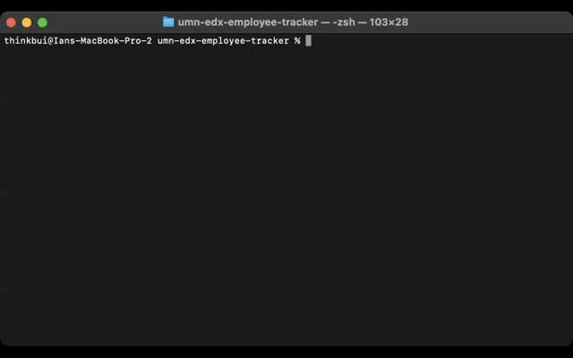

# umn-edx-employee-tracker

## SUMMARY
This is a basic command line app to manage employee information and heirarchy.  It allows for the creation of employee records, the roles they might have, who their managers are, their salaries, and which department those employees and roles belong.

## INSTALLATION
Before executing the app, you will need to setup the database and its connection.

Provided that you already have MySQL (or a compatible database server) and a script editor for it installed, the first step is to rename (or copy) the file *.env.EXAMPLE* in the root path of the project to *.env* and update its contents with your MySQL username and password.

Next you should run the script file *db/schema.sql* in your script editor to setup the database and tables used for this project.

Optionally you can run the script file *db/seeds.sql* to seed the database with data for test purposes.

Then from the command line, you can run *npm install* from the root path of the project to ensure that all needed packages are available for the apps use.

Once all of this is done, you can run *node index.js* via the command line from the root path of the project to start the app.

## NOTES
This is a very crude app that overly simplifies the human resources processes of a company.  For instance, the salaries are managed at the role level meaning all employees that have that role are all have the same salary with no functionality for individual pay increases, decreases, bonuses, or penalties.  There is a workaround for this by creating multiple duplicate roles that have different salaries, but that does not scale becoming increasingly difficult to keep track of the more the these duplicate roles are in the system.

I had hoped to wrap the code in the *main* function in a while loop so that the function is only executed once, but never got it to work quite right and, with the deadline of this study looming, was forced to settle for a recursive approach where the *main* function is passed as a parameter so that it's the last executed by other functions.

The code is a little cluttered in that queries to the *departments* and *roles* tables live in *db/db_roles.js* and *db/db_employees.js* respectively.  Due to time constraints, this was not addressed during this study, but from a maintenance standpoint, those queries should be moved to the appropriate files so that *db/db_roles.js* only knows about the *roles* table and likewise for the other files and tables much like standard practices for ORMs such as Sequelize.

This project also need tests.  In the interest of time, studying of mocking/stubbing and test databases was skipped and manual testing was conducted to validate functionality.  The jest package and others would be needed to build a thorough test suite that can be executed from the command line.

## DEMO
You can view a demo of the app on [YouTube](https://www.youtube.com/watch?v=Fiol7n16OTk).

